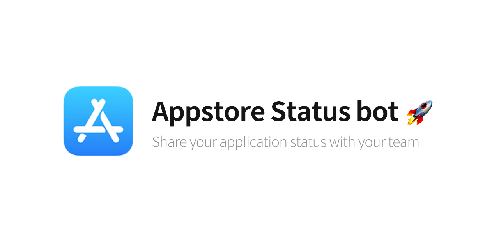
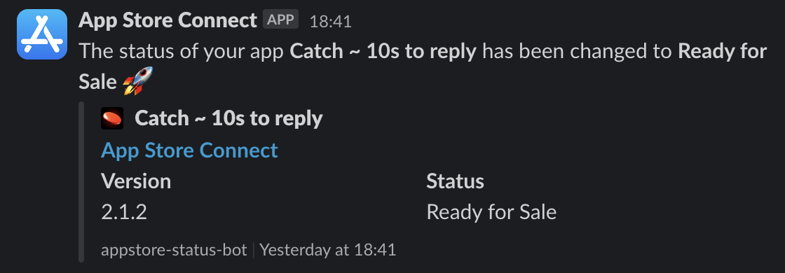

# AppStore Status Bot

## Description

App Store Connect status bot is a simple bot script fetches your app info directly from App Store Connect and post changes
 in slack as a bot using `github-actions`, help of fastlane
 [Spaceship](https://github.com/fastlane/fastlane/tree/master/spaceship)

This repository is based on [the one](https://github.com/techinpark/appstore-status-bot) made by @techinpark

## Features

- Fetch App Store Connect info using the API
- Share applications `status` to slack workspace
- Auto commit GitHub action to avoid disabling after 60 days of inactivity

## Preview

## Configuration

### Generating App Store Connect key

Generate an API Key [here](https://appstoreconnect.apple.com/access/api) and note the `Key ID` as it will used later
in the configuration of the bot.

> ⚠️ Make sure to download the `.p8` file as only available after the creation of the API key

The `Issuer ID` (identifying the creator of the API Key) is available on the
[same page](https://appstoreconnect.apple.com/access/api) will also be needed.

### Create Slack Webhook

Create a new webhook using [Slack Incoming Webhook](https://slack.com/apps/A0F7XDUAZ-incoming-webhooks?tab=settings) app.

After the creation the Webhook URL will be needed for the bot to properly send message into your Slack Workspace.

> `https://hooks.slack.com/services/XXX/YYYY/ZZZ`

### Create a Gist that will be used as storage

This bot uses a Gist to store that previous state of an App and be able to know when it changes.

Create an empty gist [here](https://gist.github.com) and use the ID of the gist later on in the configuration.

> GitHub does not allow empty Gist. First create a file with some content and remove it afterwards with an update.

### Create a GitHub access token

This bot needs to have access to GitHub for multiple reasons:

- read/write the Gist previously created
- auto commit on a branch to avoid inactivity

Create an access token [here](https://github.com/settings/tokens/new) with the `repo` and `gist` scopes.

## GitHub Action Configuration

### Environment values

| Environment variable  | description                                                                                                                                                   |
|-----------------------|---------------------------------------------------------------------------------------------------------------------------------------------------------------|
| APP_STORE_PRIVATE_KEY | App Store Connect .p8 file content                                                                                                                            |
| APP_STORE_KEY_ID      | App Store Connect .p8 Key ID                                                                                                                                  |
| APP_STORE_ISSUER_ID   | App Store Connect API Key creator ID                                                                                                                          |
| APP_STORE_BUNDLE_IDS  | List of the iOS Apps Bundle IDs that will be checked. (separated by a comma) Eg: `com.MyApp, com.MyApp2`                                                      |
| SLACK_WEBHOOK_URL     | URL of the Slack Webhook that will send messages into the workspace                                                                                           |
| GH_GIST_ID        | ID of the Gist that will be used to store previous App Store Connect data. It is the last part of the URL of the Gist gist.github.com/xxx/{ID}                |
| GH_TOKEN          | GitHub access token with the `gists` and `repo` scope enabled The owner of the access token also needs to have write/read access to the previously given Gist |

### Auto Commit

`Auto Commit` runs by default once a day.

It pushes an `auto_commit` file containing the current date to a branch named `auto-commit`.

It can be configured by changing the [`commit.yml` file](./.github/workflows/commit.yml).

### Get App Store Info

`Get App Store Info` runs by default every 15 minutes.

It retrieves the gist data, then uses the App Store Connect API to read the current states of every configured app.
If there is a difference between the gist stored data and the current API data a message will be sent to Slack via
 the Webhook and the new state stored in the Gist.

It can be configured by changing the [`info.yml` file](./.github/workflows/info.yml).
